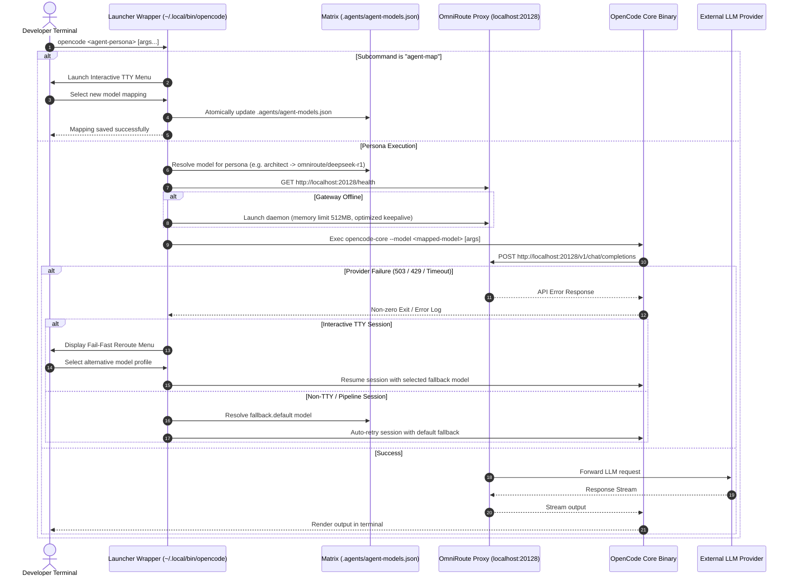
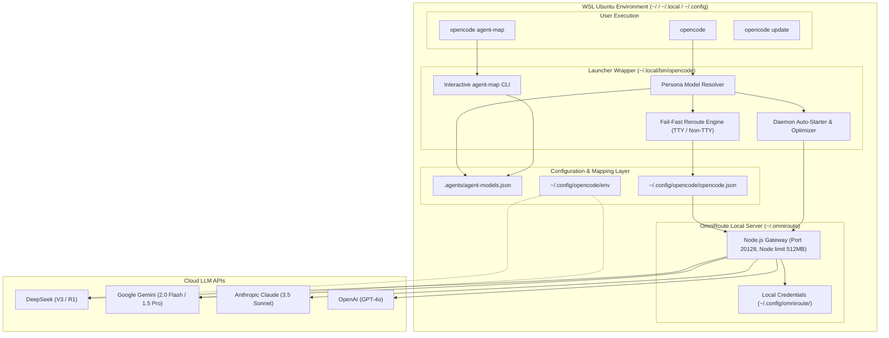

# System Architecture: OpenCode + OmniRoute Integration & Agent Routing

## Overview

The **OpenCode + OmniRoute Integration CLI** provides a unified, cost-optimized terminal AI development environment in native WSL (Ubuntu Linux). It bridges **OpenCode** (a terminal AI coding agent) with **OmniRoute** (a local AI gateway server running on port `20128`) to route requests across multiple LLM providers—including DeepSeek (V3 & R1), Google Gemini (2.0 Flash & 1.5 Pro), Anthropic Claude (3.5 Sonnet), OpenAI (GPT-4o), and Qwen.

Phase 2 expands this integration with:
1. **Per-Project Agent Model Mapping Matrix**: Granular assignment of `core_workflow` agent personas (`architect`, `executor`, `specifier-grill`, `specifier-prd`, `review-council`, `prototype`) to OmniRoute model aliases via `.agents/agent-models.json`.
2. **Interactive CLI Management (`opencode agent-map`)**: TTY-driven terminal interface to view and switch model mappings interactively.
3. **Session Model Injection**: Automated `--model` flag injection based on active persona.
4. **Interactive Fail-Fast Rerouting**: TTY error interception on 503/429/connection drops with interactive failover prompt (and non-TTY auto-fallback).
5. **Daemon Launch Optimization**: Memory-capped (`--max-old-space-size=512`), low-verbosity, keep-alive optimized OmniRoute Node.js daemon.

---

## Architectural Diagrams

### 1. System Sequence Diagram (Agent Persona Routing & Fail-Fast Recovery)

### 2. Component Topology Diagram

---

## Codebase Impact Analysis

- **Impact Level**: Low-Medium (Wrapper script logic expansion, configuration schema, zero core modifications).
- **Files Created / Modified**:
  - `.agents/agent-models.json`: Declarative mapping schema for workflow agent personas.
  - `templates/agent-models.json.template`: Template file for setup generation.
  - `templates/opencode-wrapper.sh.template` & `~/.local/bin/opencode`: Enhanced launcher wrapper with `agent-map` subcommand, persona injection, fail-fast rerouting, and optimized background daemon boot.
  - `scripts/install-omniroute.sh`: Node.js daemon flag optimizations (`--max-old-space-size=512`).
  - `setup-opencode-omniroute.sh`: Updated setup script to seed `.agents/agent-models.json`.

---

## Vertical-Sliced Build Phases (Iteration v2)

1. **Phase 1 — Agent Model Mapping Matrix Schema & Setup Integration**: Define `.agents/agent-models.json` schema, create template, and update `setup-opencode-omniroute.sh` to generate default matrix upon setup/update.
2. **Phase 2 — Session Model Injection & Interactive CLI (`opencode agent-map`)**: Update wrapper script to parse persona mappings, inject `--model` flags, and provide an interactive ANSI/TTY terminal menu for `opencode agent-map`.
3. **Phase 3 — Interactive Fail-Fast Rerouting Engine**: Add error detection wrapper to intercept 503/429/connection failures, presenting an interactive prompt in TTY or auto-falling back in non-TTY mode.
4. **Phase 4 — OmniRoute Daemon Launch Optimization**: Tune Node.js launch flags (`--max-old-space-size=512`), socket keepalive, log verbosity filtering, and localhost binding in daemon startup scripts.
