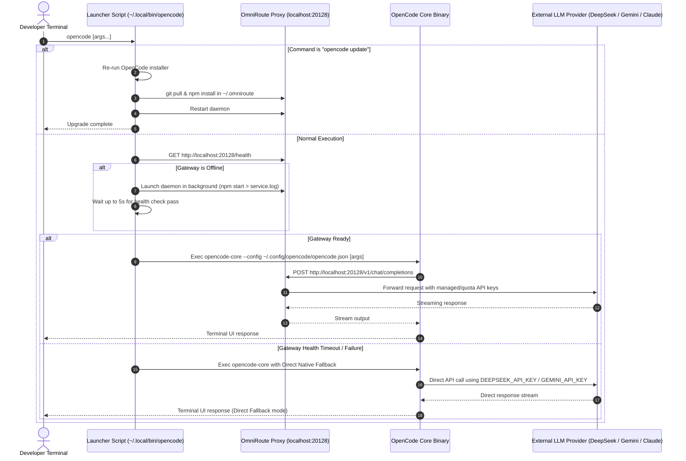
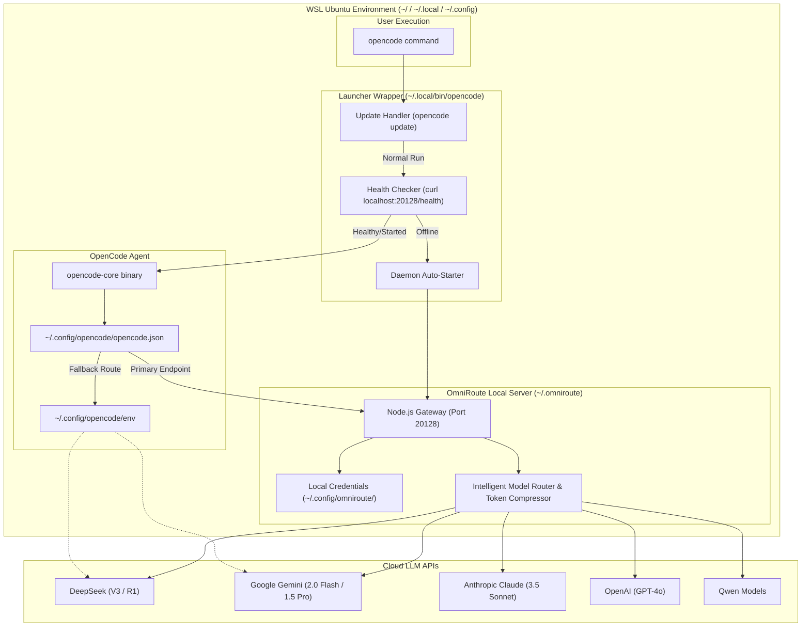

# System Architecture: OpenCode + OmniRoute Integration CLI

## Overview

The **OpenCode + OmniRoute Integration CLI** provides a unified, cost-optimized terminal AI development environment in native WSL (Ubuntu Linux). It bridges **OpenCode** (a terminal AI coding agent) with **OmniRoute** (a local AI gateway server running on port `20128`) to route requests across multiple LLM providers—including DeepSeek (V3 & R1), Google Gemini (2.0 Flash & 1.5 Pro), Anthropic Claude (3.5 Sonnet), OpenAI (GPT-4o), and Qwen.

The system features:
1. Transparent daemon management via a custom bash wrapper (`~/.local/bin/opencode`).
2. Single-pass updates (`opencode update` / `./setup-opencode-omniroute.sh --update`).
3. Direct native API key fallbacks in OpenCode if the local proxy gateway is offline.
4. Comprehensive project documentation standard.

---

## Architectural Diagrams

### 1. System Sequence Diagram

### 2. Component Topology Diagram

---

## Codebase Impact Analysis

- **Impact Level**: Low-Medium (New repository configuration, launcher wrapper scripts, and automated installer setup without altering existing upstream packages).
- **Files Created / Configured**:
  - `setup-opencode-omniroute.sh`: Single-command installer & maintainer script.
  - `templates/opencode.json.template`: OpenCode primary & fallback configuration template.
  - `templates/opencode-wrapper.sh.template`: Smart bash launcher wrapper.
  - `README.md`: Master project documentation.
  - `docs/ARCHITECTURE.md`: Technical architecture reference.
  - `docs/QUICKSTART.md`: Step-by-step setup guide.
  - `docs/TROUBLESHOOTING.md`: Maintenance and troubleshooting manual.

---

## Vertical-Sliced Build Phases

The implementation is structured into 5 vertical slices:

1. **Phase 1 — OmniRoute Gateway Setup & Health Verification**: Install OmniRoute into `~/.omniroute`, configure port `20128`, write health check validator script, and verify `/health` endpoint.
2. **Phase 2 — OpenCode Agent Configuration & Model Aliases**: Generate `opencode.json` with primary OmniRoute profiles (`omniroute/auto`, `omniroute/deepseek-r1`, `omniroute/gemini-2.0-flash`) and direct fallback definitions.
3. **Phase 3 — Smart Launcher Wrapper (`opencode`)**: Implement `~/.local/bin/opencode` wrapper with health-checking daemon auto-start and `opencode update` pass-through interception.
4. **Phase 4 — Automated Setup Script (`setup-opencode-omniroute.sh`)**: Create self-contained installer script handling prerequisite validation, setup, key prompts, `--update` flag, and automated verification suite.
5. **Phase 5 — Repository Documentation Standard**: Produce complete project documentation suite (`README.md`, `ARCHITECTURE.md`, `QUICKSTART.md`, `TROUBLESHOOTING.md`).
