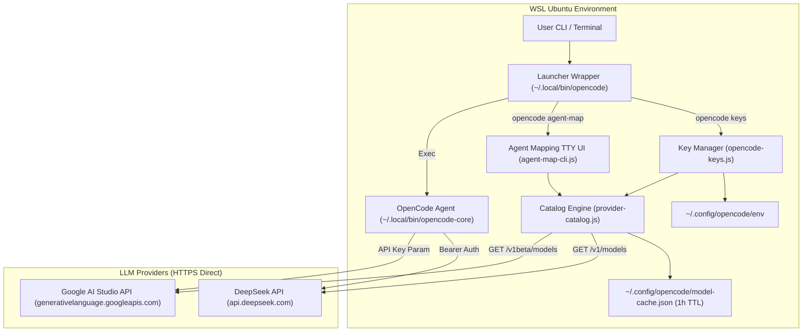

# Architecture Reference: Direct Provider Routing & Key Gating

## Overview

The **OpenCode Integration** routes AI coding queries directly to upstream provider APIs (DeepSeek and Google AI Studio) using native API keys stored in `~/.config/opencode/env`. The local proxy is removed from the critical path. All model selections are gated by key presence and populated dynamically via live catalog queries.

---

## Component Topology

---

## Configuration Files & Locations

| Component | Path / Location | Description |
| :--- | :--- | :--- |
| **Provider API Keys** | `~/.config/opencode/env` | Restricted (`chmod 600`) env file storing `DEEPSEEK_API_KEY` and `GEMINI_API_KEY` |
| **OpenCode Config** | `~/.config/opencode/opencode.json` | Auto-generated provider definitions (`deepseek`, `gemini`) and agent mappings |
| **Model Cache** | `~/.config/opencode/model-cache.json` | 1-hour TTL JSON cache with SHA-256 `keyHash` validation |
| **Agent Matrix** | `.agents/agent-models.json` | Workspace persona-to-model mapping matrix |
