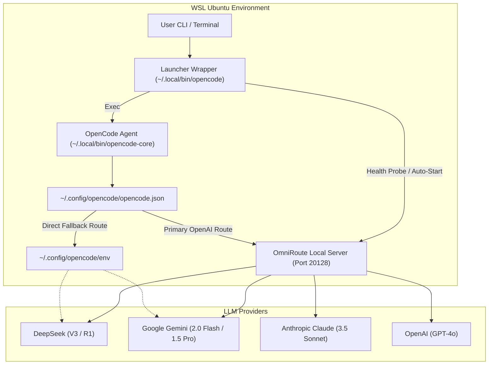

# Architecture Reference: OpenCode + OmniRoute Integration

## Overview

The **OpenCode + OmniRoute Integration CLI** establishes a unified local AI gateway proxy inside Windows Subsystem for Linux (WSL Ubuntu). It routes AI coding queries from **OpenCode** (a terminal AI coding agent) across multiple frontier model APIs via **OmniRoute** (local proxy gateway running on port `20128`).

---

## Component Topology

---

## Port Mappings & Services

| Service / Component | Port / Location | Description |
| :--- | :--- | :--- |
| **OmniRoute Proxy** | `http://localhost:20128/v1` | Primary OpenAI-compatible API endpoint |
| **OmniRoute Health Check**| `http://localhost:20128/health` | Health monitoring endpoint |
| **OmniRoute Dashboard** | `http://localhost:20128/dashboard` | Web dashboard for local API key management |
| **OpenCode Config** | `~/.config/opencode/opencode.json` | Agent provider & model alias definitions |
| **Fallback Env** | `~/.config/opencode/env` | Restricted (`chmod 600`) direct provider credentials |

---

## Failover Strategy

If OmniRoute is offline or fails to start within 5 seconds:
1. The launcher wrapper logs a diagnostic warning to stderr.
2. OpenCode falls back to direct API keys stored in `~/.config/opencode/env`.
3. Terminal coding sessions remain completely uninterrupted.
